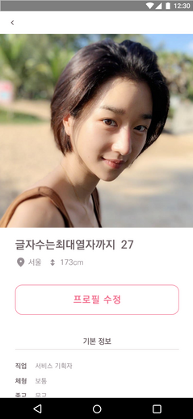
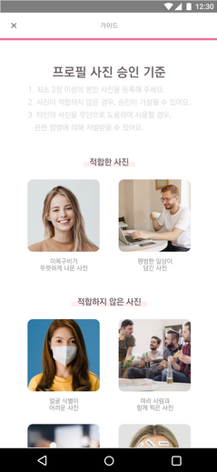
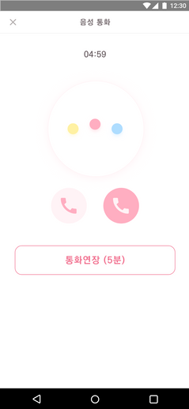

# 에로스 데이팅 앱 개발 프로젝트
* 총 기간: 아이디어 및 기능 조율(2달) + 개발(3달) 

| | | | | |
|:-:|:-:|:-:|:-:|:-:|
||||||

### 1. 개발 목표
1. 작은 툴 보단 큰 서비스 개발 (조금 큰 규모로 하고 싶은 욕심)
2. 모바일 앱 개발 (개발 경험 영역을 넓히고자)
3. 팀원 역할 분배 (기획자, 디자이너, 개발자로 팀 구성)

### 2. 데이팅 앱 주제 선정 이유
1. 잘 기획할 수 있는 앱 (기획자 중심으로)
2. 앱을 런칭 가능성 (운영 가능성을 두고)

### 3. 개발 과정
1. 데이팅 앱 및 타겟 사용자 분석
2. 기본 기능 및 아이디어 정의
3. 와이어 프레임 작성 (XD)
4. 디자인 (XD, Zeplin)
5. 앱 개발 (Flutter)
6. 한주 마다 팀원 피드백 (다시 3번으로)

&nbsp;&nbsp;&nbsp;&nbsp;&nbsp;&nbsp;&nbsp;&nbsp;&nbsp;&nbsp;

### 4. 타사 데이팅 앱
1. 틴더: 해외 Dating App 기준 업계 1위, 2020 스마트폰으로 가장 많이 결제된 앱 1위 (157억 달러)
2. 아만다: 국내 개발 Dating App 기준 업계 1위, 2년 연속 국내 앱 매출 상승 5위 2017년 기준 일 매출 3,000만원
3. 탄탄: 성장률 1위 2017년 ~ 2019년 사이 약 700배의 성장세에 2020년 8.910억원에 인수합병

| | | |
|:-:|:-:|:-:|
| 틴더| 아만다| 탄탄|

### 5. 타겟 사용자 선정
1. 남성: 대화 초보편, 데이트 경험 無편, 과금 의심편
2. 여성: 결제 유도 이탈편, 나를 위한 사람편, 총체적 난관편

| | | |
|:-:|:-:|:-:|
| 대화 초보편| 데이트 경험 無편| 과금 의심편|
| 결제 유도 이탈편| 나를 위한 사람편| 총체적 난관편|

### 6. 스타일 가이드
* 개발 편의를 위해 기본적인 스타일을 지정

<!--  -->

### 7. 확장성을 위해 개발에 고려한 점
* android, ios 크로스 플랫폼 (Flutter 사용)
* i18n, l10n 다개국어 지원 
* light, dark 모드 지원
* UI 컴포넌트 개발
* 디자인 패턴 적용 (Provider 패턴)

```
source
├── assets
│   ├── fonts
│   ├── icons
│   ├── images
│   └── translations
├── lib
│   ├── configs
│   ├── providers
│   ├── utils
│   └── widgets
│       ├── componets
│       └── pages
└── pubspec.yaml
```

### 8. 페이지 구성 [[흐름도](./readme/flow.pdf)]
* 로그인 페이지
* 계정/비밀번호 찾기 페이지
* 계정 생성 페이지
* 프로필 등록 페이지 (기본 정보, 태그, 사진)
* 성향 설문 페이지
* 프로필 조회/관리 페이지
* 오늘의 매칭 페이지
* 요청 확인 페이지
* 채팅 페이지
* 기타 페이지 (스플레시, 에러)

| | | | | |
|:-:|:-:|:-:|:-:|:-:|
||||||

### 9. TODO 리스트 (아이디어 포함)
* 전화번호 인증 및 (비)승인 페이지
* 랜덤 음성/영상 통화 페이지
* 결제 관련 정책/기능 페이지
* 자연스러운 대화를 위한 첫 인상 이야기 페이지
* 데이터 수집을 위한 내 성향 초이스 페이지
* O2O 서비스를 고려한 데이팅 장소 추천 페이지
* 음란물 데이터 수집을 위한 FWB 모드 
* 각종 설정 페이지
* Admin 웹 페이지

| | | | | |
|:-:|:-:|:-:|:-:|:-:|
||||||
